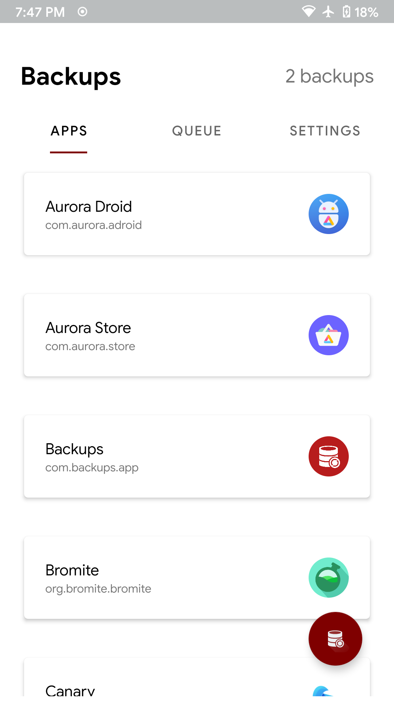
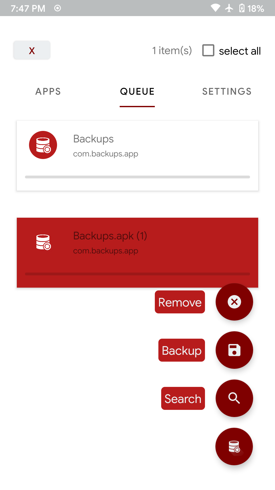
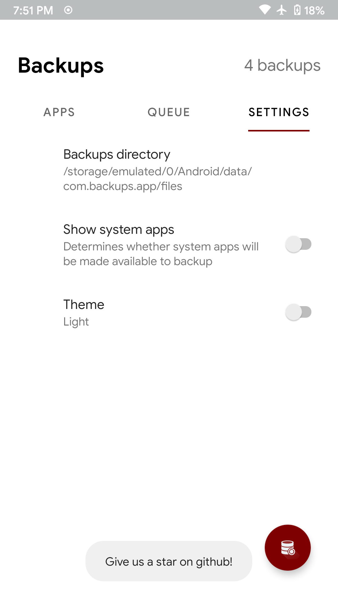
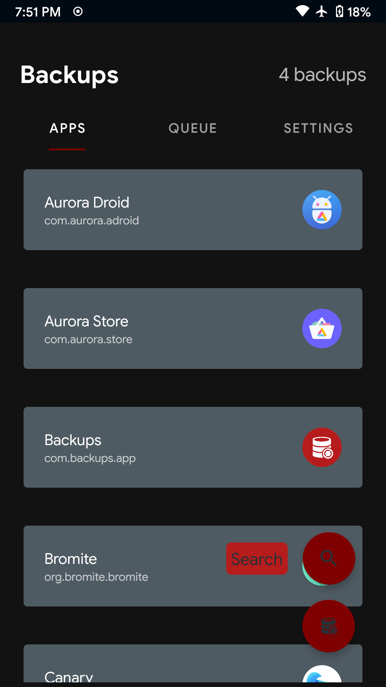
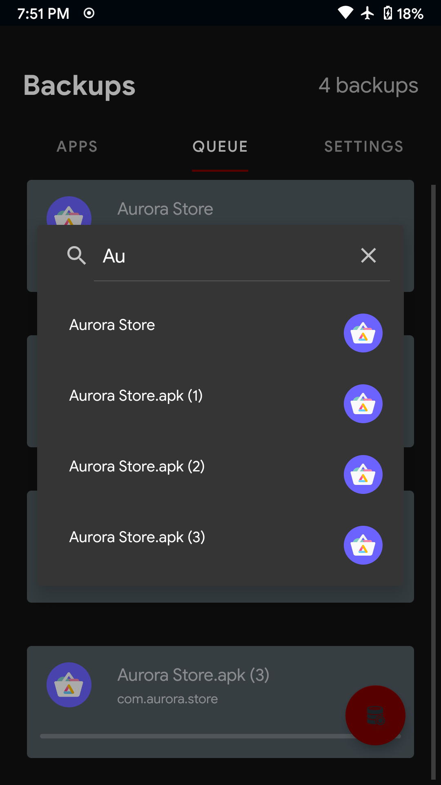

# Backups - Another apk backup app

Logo by: https://github.com/StefanGreve

An android app for creating backups of installed apk files

## Screenshots 📸

## Features ✨

- Backup system/"user installed" apps 💻
- SD card detection 💾
- No permissions required 👌

  (backups are saved to app directory

  `<storage-path>/Android/com.backups.app/files`)

- Dark mode 🌒
- Backup searching 🔍
- Backup removal 🇽
- Output storage selection 📝
- Material Design 🎴
